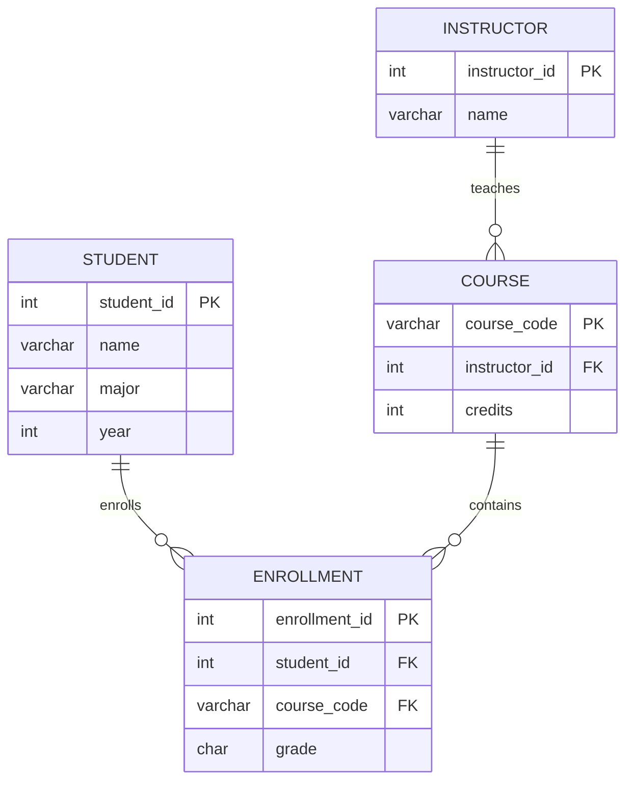

# SQL Exercise Report

**창원대학교 데이터베이스 개론 수업에서 진행한 MariaDB SQL 실습 보고서입니다.**

학생·강사·과목·수강신청 테이블을 만들고, 데이터 삽입부터 조회·집계·수정·삭제까지 쿼리와 실행 결과를 기록했습니다.

`MariaDB` · `SQL` · `HeidiSQL`

[쿼리와 실행 결과 전체](docs/sql-report.md) · [제출 보고서 PDF](docs/보고서.pdf)

## 데이터 구조



다이어그램의 `STUDENT`, `INSTRUCTOR`, `COURSE`, `ENROLLMENT`는 보고서의 `학생`, `강사`, `과목`, `수강신청`에 대응합니다.

## 실습 내용

| 단계 | 확인할 내용 |
| --- | --- |
| 테이블 생성 | PK, FK, NOT NULL, CHECK, DEFAULT |
| 데이터 준비 | 각 테이블의 INSERT 문과 입력 결과 |
| 조건 조회 | WHERE와 ORDER BY |
| 중복·서브쿼리 | DISTINCT와 하위 쿼리 |
| 집계 | GROUP BY와 HAVING |
| 수정 | NULL 조건에 따른 UPDATE |
| 관계 조회 | 과목·강사·수강 인원 연결 |
| 삭제 | 수강하지 않은 학생을 찾는 DELETE |

## 읽고 재현하는 순서

1. [보고서](docs/sql-report.md)의 DDL에서 스키마를 확인합니다.
2. DML 예시로 실습 데이터를 준비합니다.
3. 각 문제의 쿼리와 결과 표를 비교합니다.

보고서는 학습 과정 중 변경된 스키마와 쿼리를 함께 기록한 문서입니다. 최종 DDL에는 `성적` 필드가 이미 있으므로, 뒤의 `ALTER TABLE` 추가 단계까지 그대로 중복 실행하지 않도록 확인합니다.

## 조회 예시

```sql
SELECT 학번, 이름, 전공, 학년
FROM 학생
WHERE 학년 = 3
ORDER BY 학번;
```

실제 과제 쿼리와 결과는 [전체 보고서](docs/sql-report.md)에서 확인할 수 있습니다.
