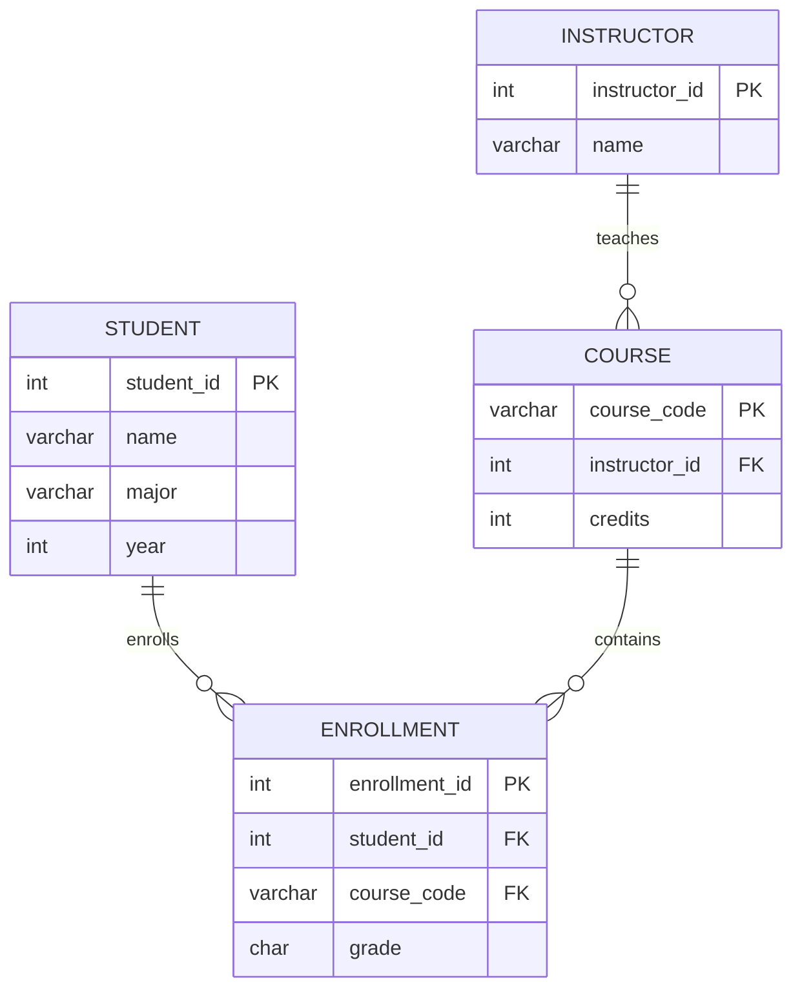

<a id="project-overview-added"></a>

[프로젝트 안내](#project-overview-added) · [기존 README 전체 내용](#original-readme-preserved)

# SQL Exercise Report

**창원대학교 데이터베이스 개론 수업에서 진행한 MariaDB SQL 실습 보고서입니다.**

학생·강사·과목·수강신청 테이블을 만들고, 데이터 삽입부터 조회·집계·수정·삭제까지 쿼리와 실행 결과를 기록했습니다.

`MariaDB` · `SQL` · `HeidiSQL`

[쿼리와 실행 결과 전체](#original-readme-preserved) · [제출 보고서 PDF](docs/보고서.pdf)

## 데이터 구조



다이어그램의 `STUDENT`, `INSTRUCTOR`, `COURSE`, `ENROLLMENT`는 보고서의 `학생`, `강사`, `과목`, `수강신청`에 대응합니다.

## 실습 내용

| 단계 | 확인할 내용 |
| --- | --- |
| 테이블 생성 | PK, FK, NOT NULL, CHECK, DEFAULT |
| 데이터 준비 | 각 테이블의 INSERT 문과 입력 결과 |
| 조건 조회 | WHERE와 ORDER BY |
| 중복·서브쿼리 | DISTINCT와 하위 쿼리 |
| 집계 | GROUP BY와 HAVING |
| 수정 | NULL 조건에 따른 UPDATE |
| 관계 조회 | 과목·강사·수강 인원 연결 |
| 삭제 | 수강하지 않은 학생을 찾는 DELETE |

## 읽고 재현하는 순서

1. [보고서](#original-readme-preserved)의 DDL에서 스키마를 확인합니다.
2. DML 예시로 실습 데이터를 준비합니다.
3. 각 문제의 쿼리와 결과 표를 비교합니다.

보고서는 학습 과정 중 변경된 스키마와 쿼리를 함께 기록한 문서입니다. 최종 DDL에는 `성적` 필드가 이미 있으므로, 뒤의 `ALTER TABLE` 추가 단계까지 그대로 중복 실행하지 않도록 확인합니다.

## 조회 예시

```sql
SELECT 학번, 이름, 전공, 학년
FROM 학생
WHERE 학년 = 3
ORDER BY 학번;
```

실제 과제 쿼리와 결과는 [전체 보고서](#original-readme-preserved)에서 확인할 수 있습니다.

---

<a id="original-readme-preserved"></a>

## 기존 README 전체 내용

# SQL-Exercise-Report
창원대학교 DB 개론 수업에서의 SQL 실습 과제 보고서

```text
실제 보고서는 docs폴더 안의 보고서.pdf로 첨부하였습니다
```

DB 개론 과제 보고서
===================

목차
----
1. Maria DB 컴퓨터 설치 인증
2. DDL 작성 - 테이블 생성
3. DML 작성 - 각 테이블 데이터 10개 삽입
4. 문제풀이 - 과제에 제시된 5문제에 대한 쿼리문과 그 결과

1. Maria DB 컴퓨터 설치 인증
----------------------------
20223149 황대겸

HeidiSQL 실행 화면과 Window CMD에서 ipconfig 명령어를 실행하여 IP를 표시한 화면

```text
Windows IP 구성

이더넷 어댑터 VMware Network Adapter VMnet1:
   연결별 DNS 접미사. . . . :
   링크-로컬 IPv6 주소 . . . . : fe80::dea:afda:adfe:ace6%17
   IPv4 주소 . . . . . . . . . : 192.168.93.1
   서브넷 마스크 . . . . . . . : 255.255.255.0
   기본 게이트웨이 . . . . . . :

이더넷 어댑터 VMware Network Adapter VMnet8:
   연결별 DNS 접미사. . . . :
   링크-로컬 IPv6 주소 . . . . : fe80::52ab:bb20:b0f0:dd27%9
   IPv4 주소 . . . . . . . . . : 192.168.48.1
   서브넷 마스크 . . . . . . . : 255.255.255.0
   기본 게이트웨이 . . . . . . :

무선 LAN 어댑터 Wi-Fi:
   연결별 DNS 접미사. . . . :
   링크-로컬 IPv6 주소 . . . . : fe80::fe51:38b1:4bab:f9e2%21
   IPv4 주소 . . . . . . . . . : 10.200.104.148
   서브넷 마스크 . . . . . . . : 255.255.192.0
   기본 게이트웨이 . . . . . . : 10.200.64.1
```

2. DDL 작성 - 테이블 생성
-------------------------
학생 테이블 생성
```sql
CREATE TABLE 학생 (
    학번 INT PRIMARY KEY,
    이름 VARCHAR(3) NOT NULL,
    전공 VARCHAR(10),
    학년 INT CHECK(학년 >= 1 AND 학년 <= 4)
);
```

강사 테이블 생성
```sql
CREATE TABLE 강사 (
    강사번호 INT PRIMARY KEY,
    강사이름 VARCHAR(3) NOT NULL,
    소속학과 VARCHAR(10),
    이메일 VARCHAR(20)
);
```

과목 테이블 생성
```sql
CREATE TABLE 과목 (
    과목코드 VARCHAR(10) PRIMARY KEY,
    과목명 VARCHAR(18) NOT NULL,
    학점 INT DEFAULT 3,
    강사번호 INT,
    FOREIGN KEY (강사번호) REFERENCES 강사(강사번호)
);
```

수강신청 테이블 생성 (속성 성적 CHAR(2) 추가 후)
```sql
CREATE TABLE 수강신청 (
    신청번호 INT AUTO_INCREMENT PRIMARY KEY,
    학번 INT,
    과목코드 VARCHAR(10),
    신청일자 DATETIME,
    성적 CHAR(2),
    FOREIGN KEY (학번) REFERENCES 학생(학번),
    FOREIGN KEY (과목코드) REFERENCES 과목(과목코드)
);
```

3. DML 작성 - 데이터 삽입
-------------------------
학생 테이블에 데이터 10개 삽입
```sql
INSERT INTO 학생(학번, 이름, 전공, 학년) VALUES
(20223149, '황대겸', '컴퓨터 공학과', 3),
(20223148, '황두겸', '컴퓨터 공학과', 3),
(20223147, '심민준', '컴퓨터 공학과', 3),
(20223146, '최길웅', '컴퓨터 공학과', 3),
(20223145, '최길동', '컴퓨터 공학과', 3),
(20223144, '최길은', '컴퓨터 공학과', 3),
(20223143, '최길금', '컴퓨터 공학과', 3),
(20223142, '최자금', '컴퓨터 공학과', 3),
(20223141, '최자동', '컴퓨터 공학과', 3),
(20223140, '최자은', '컴퓨터 공학과', 3);
```

| 번호 | 학번 | 이름 | 전공 | 학년 |
|---|---|---|---|---|
| 1 | 20223140 | 최자은 | 컴퓨터 공학과 | 3 |
| 2 | 20223141 | 최자동 | 컴퓨터 공학과 | 3 |
| 3 | 20223142 | 최자금 | 컴퓨터 공학과 | 3 |
| 4 | 20223143 | 최길금 | 컴퓨터 공학과 | 3 |
| 5 | 20223144 | 최길은 | 컴퓨터 공학과 | 3 |
| 6 | 20223145 | 최길동 | 컴퓨터 공학과 | 3 |
| 7 | 20223146 | 최길웅 | 컴퓨터 공학과 | 3 |
| 8 | 20223147 | 심민준 | 컴퓨터 공학과 | 3 |
| 9 | 20223148 | 황두겸 | 컴퓨터 공학과 | 3 |
| 10 | 20223149 | 황대겸 | 컴퓨터 공학과 | 3 |

강사 테이블에 데이터 10개 삽입
```sql
INSERT INTO 강사 VALUES
(1, '최지은', '컴퓨터 공학과', 'example3461@gmai.com'),
(2, '최자은', '컴퓨터 공학과', '3462@gmai.com'),
(3, '정지은', '컴퓨터 공학과', '3463@gmai.com'),
(4, '최희은', '컴퓨터 공학과', '3464@gmai.com'),
(5, '지지은', '컴퓨터 공학과', '3465@gmai.com'),
(6, '은지은', '컴퓨터 공학과', '3466@gmai.com'),
(7, '주지은', '컴퓨터 공학과', '3467@gmai.com'),
(8, '황지은', '컴퓨터 공학과', '3468@gmai.com'),
(9, '심지은', '컴퓨터 공학과', '3469@gmai.com'),
(10, '배지은', '컴퓨터 공학과', '34610@gmai.com');
```

| 강사번호 | 강사이름 | 소속학과 | 이메일 |
|---|---|---|---|
| 1 | 최지은 | 컴퓨터 공학과 | example3461@gmai.com |
| 2 | 최자은 | 컴퓨터 공학과 | 3462@gmai.com |
| 3 | 정지은 | 컴퓨터 공학과 | 3463@gmai.com |
| 4 | 최희은 | 컴퓨터 공학과 | 3464@gmai.com |
| 5 | 지지은 | 컴퓨터 공학과 | 3465@gmai.com |
| 6 | 은지은 | 컴퓨터 공학과 | 3466@gmai.com |
| 7 | 주지은 | 컴퓨터 공학과 | 3467@gmai.com |
| 8 | 황지은 | 컴퓨터 공학과 | 3468@gmai.com |
| 9 | 심지은 | 컴퓨터 공학과 | 3469@gmai.com |
| 10 | 배지은 | 컴퓨터 공학과 | 34610@gmai.com |

과목 테이블에 데이터 10개 삽입
```sql
INSERT INTO 과목 VALUES
('ACGT', 'DB개론', DEFAULT, 1),
('ACGK', 'DB개론', DEFAULT, 2),
('ACGM', '컴퓨터구조', DEFAULT, 3),
('ACGC', '알고리즘', DEFAULT, 4),
('ACGX', '모바일프로그래밍', DEFAULT, 5),
('ACGZ', '데이타베이스개론', DEFAULT, 6),
('ACGQ', '쿠쿠다스이론', DEFAULT, 7),
('ACGW', '수수수퍼노바', DEFAULT, 8),
('ACGE', '즐거운 대학생활', 2, NULL),
('ACGR', '화법과 토론', 2, NULL);
```

| 과목코드 | 과목명 | 학점 | 강사번호 |
|---|---|---|---|
| ACGC | 알고리즘 | 3 | 4 |
| ACGE | 즐거운 대학생활 | 2 | (NULL) |
| ACGK | DB개론 | 3 | 2 |
| ACGM | 컴퓨터구조 | 3 | 3 |
| ACGQ | 쿠쿠다스이론 | 3 | 7 |
| ACGR | 화법과 토론 | 2 | (NULL) |
| ACGT | DB개론 | 3 | 1 |
| ACGW | 수수수퍼노바 | 3 | 8 |
| ACGX | 모바일프로그래밍 | 3 | 5 |
| ACGZ | 데이타베이스개론 | 3 | 6 |

수강신청 테이블에 데이터 10개 삽입
```sql
INSERT INTO 수강신청(학번, 과목코드, 신청일자) VALUES
(20223149, 'ACGK', '2026-04-14 19:43:15'),
(20223149, 'ACGK', '2026-04-14 19:43:15'),
(20223149, 'ACGM', '2026-04-14 19:43:15'),
(20223149, 'ACGC', '2026-04-14 19:43:15'),
(20223149, 'ACGX', '2026-04-14 19:43:15'),
(20223149, 'ACGZ', '2026-04-14 19:43:15'),
(20223147, 'ACGQ', '2026-04-14 19:43:15'),
(20223140, 'ACGW', '2026-04-14 19:43:15'),
(20223140, 'ACGE', '2026-04-14 19:43:15'),
(20223142, 'ACGR', '2026-04-14 19:43:15');
```

| 신청번호 | 학번 | 과목코드 | 성적 | 신청일자 |
|---|---|---|---|---|
| 1 | 20223149 | ACGK | (NULL) | 2026-04-14 19:43:15 |
| 2 | 20223149 | ACGK | (NULL) | 2026-04-14 19:43:15 |
| 3 | 20223149 | ACGM | (NULL) | 2026-04-14 19:43:15 |
| 4 | 20223149 | ACGC | (NULL) | 2026-04-14 19:43:15 |
| 5 | 20223149 | ACGX | (NULL) | 2026-04-14 19:43:15 |
| 6 | 20223149 | ACGZ | (NULL) | 2026-04-14 19:43:15 |
| 7 | 20223147 | ACGQ | (NULL) | 2026-04-14 19:43:15 |
| 8 | 20223140 | ACGW | (NULL) | 2026-04-14 19:43:15 |
| 9 | 20223140 | ACGE | (NULL) | 2026-04-14 19:43:15 |
| 10 | 20223142 | ACGR | (NULL) | 2026-04-14 19:43:15 |

4. 문제풀이
-----------
1번 문제
배경작업: 전공 '컴퓨터 공학과'를 '컴퓨터공학'으로 수정
```sql
UPDATE 학생
SET 전공 = '컴퓨터공학'
WHERE 전공 = '컴퓨터 공학과';
```

문제: '컴퓨터공학' 전공인 학생들의 이름과 학년을 조회하시오. (학년 높은 순 정렬, 같다면 이름 가나다 순 정렬)
```sql
SELECT 이름, 학년
FROM 학생
WHERE 전공 = '컴퓨터공학'
ORDER BY 학년 DESC, 이름 ASC;
```

| 번호 | 이름 | 학년 |
|---|---|---|
| 1 | 심민준 | 3 |
| 2 | 최길금 | 3 |
| 3 | 최길동 | 3 |
| 4 | 최길웅 | 3 |
| 5 | 최길은 | 3 |
| 6 | 최자금 | 3 |
| 7 | 최자동 | 3 |
| 8 | 최자은 | 3 |
| 9 | 황대겸 | 3 |
| 10 | 황두겸 | 3 |

2번 문제
문제: 3학점짜리 과목을 하나라도 강의하는 강사들의 '강사이름'을 조회하시오. (강사 이름은 중복되지 않게 한 번만 출력)
```sql
SELECT DISTINCT 강사이름
FROM 강사
WHERE 강사번호 IN(
    SELECT 강사번호
    FROM 과목
    WHERE 학점 = 3
);
```

| 번호 | 강사이름 |
|---|---|
| 1 | 최지은 |
| 2 | 최자은 |
| 3 | 정지은 |
| 4 | 최희은 |
| 5 | 지지은 |
| 6 | 은지은 |
| 7 | 주지은 |
| 8 | 황지은 |

3번 문제
문제: 각 전공(소속학과)별로 등록된 강사의 수를 구하시오. (강사 수가 2명 이상인 학과만 출력)
```sql
SELECT 소속학과 AS 전공, COUNT(*) AS '강사 수'
FROM 강사
GROUP BY 소속학과 HAVING COUNT(*) >= 2;
```

| 전공 | 강사 수 |
|---|---|
| 컴퓨터 공학과 | 10 |

4번 문제
배경작업: 속성 '성적' 추가, 강사 '홍길동' 추가 및 담당과목 변경
```sql
ALTER TABLE 수강신청 ADD 성적 VARCHAR(2);

INSERT INTO 강사 VALUES
(11, '홍길동', '막그노나르도학과', 'MACDO@gamail.com');

UPDATE 과목
SET 강사번호 = 11
WHERE 강사번호 IS NULL;
```

문제: '홍길동' 강사가 담당하는 모든 과목의 '수강신청' 내역 중, 아직 성적이 입력되지 않은(NULL) 건들의 성적을 일괄 'B+'로 수정하시오. (서브 쿼리 활용)
```sql
UPDATE 수강신청
SET 성적 = 'B+'
WHERE 성적 IS NULL AND 과목코드 IN (
    SELECT 과목코드
    FROM 과목
    WHERE 강사번호 IN (
        SELECT 강사번호
        FROM 강사
        WHERE 강사이름 = '홍길동'
    )
);
```

| 신청번호 | 학번 | 과목코드 | 성적 | 신청일자 |
|---|---|---|---|---|
| 8 | 20223140 | ACGW | (NULL) | 2026-04-14 19:43:15 |
| 9 | 20223140 | ACGE | B+ | 2026-04-14 19:43:15 |
| 10 | 20223142 | ACGR | B+ | 2026-04-14 19:43:15 |

5번 문제
배경작업: 수강신청 인원이 3명 이상인 과목이 존재하지 않아 데이터 추가
```sql
INSERT INTO 수강신청(학번, 과목코드, 신청일자, 성적) VALUES
(20223140, 'ACGK', '2026-04-12 19:22:22', 'A0'),
(20223141, 'ACGK', '2026-04-12 19:22:22', 'A0'),
(20223142, 'ACGK', '2026-04-12 19:22:22', 'A0'),
(20223143, 'ACGK', '2026-04-12 19:22:22', 'A0'),
(20223144, 'ACGK', '2026-04-12 19:22:22', 'A0');
```

문제: 현재 수강신청 인원이 3명 이상인 과목의 '과목명'과 해당 과목을 담당하는 '강사이름'을 조회하시오. (서브 쿼리 활용)
```sql
SELECT t1.과목명 AS 과목명, t2.강사이름 AS 강사이름
FROM 과목 AS t1, 강사 AS t2
WHERE t1.과목코드 IN(
    SELECT 과목코드
    FROM 수강신청
    GROUP BY 과목코드 HAVING COUNT(*) >= 3
) AND t1.강사번호 = t2.강사번호;
```

| 과목명 | 강사이름 |
|---|---|
| DB개론 | 최자은 |

6번 문제
문제: 수강생이 단 한 명도 없는(수강신청 내역이 없는) 과목들을 과목 테이블에서 삭제하시오. (서브 쿼리 활용)
```sql
DELETE
FROM 과목
WHERE 과목코드 NOT IN (
    SELECT 과목코드
    FROM 수강신청
);
```

| 과목코드 | 과목명 | 학점 | 강사번호 |
|---|---|---|---|
| ACGC | 알고리즘 | 3 | 4 |
| ACGE | 즐거운 대학생활 | 2 | 11 |
| ACGK | DB개론 | 3 | 2 |
| ACGM | 컴퓨터구조 | 3 | 3 |
| ACGQ | 쿠쿠다스이론 | 3 | 7 |
| ACGR | 화법과 토론 | 2 | 11 |
| ACGW | 수수수퍼노바 | 3 | 8 |
| ACGX | 모바일프로그래밍 | 3 | 5 |
| ACGZ | 데이타베이스개론 | 3 | 6 |
